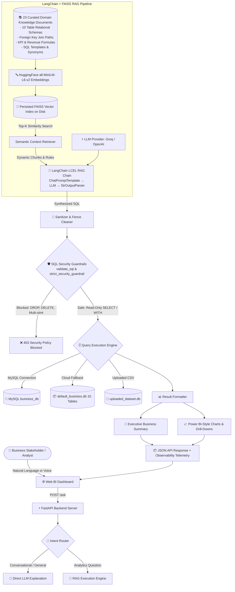

# Enterprise AI BI Assistant — Natural Language Data Analytics Platform

[](https://www.python.org/)
[](https://fastapi.tiangolo.com/)
[](https://www.langchain.com/)
[](https://github.com/facebookresearch/faiss)
[](https://groq.com/)
[](https://www.chartjs.org/)
[](LICENSE)

An enterprise-style, natural language **Business Intelligence & Text-to-SQL Analytics Platform** built with **FastAPI**, **LangChain**, **FAISS Vector Search**, **Groq / OpenAI API**, **MySQL**, **SQLite**, and **Chart.js**.

The platform allows business users and data analysts to ask questions in plain English or via speech input, automatically retrieving relevant table schemas and join rules via FAISS, generating read-only SQL queries with LangChain LCEL, executing against relational databases or uploaded CSV files, and presenting executive summaries, KPI metric cards, data tables, and interactive visualizations.

---

## 1. Business Problem

Traditional BI dashboards often present friction for non-technical stakeholders:
- Ad-hoc business questions require dedicated data engineering tickets to write SQL queries.
- Static dashboard tiles cannot answer unexpected multidimensional inquiries or granular drill-downs.
- Naive LLM text-to-SQL solutions that dump entire multi-table schemas into the prompt suffer from context-window bloat, hallucinated join paths, and slow inference.
- Direct LLM database access presents critical security risks (SQL injection, unintentional data modification, destructive DDL/DML).

This platform solves these problems through an isolated, read-only **Retrieval-Augmented Generation (RAG)** pipeline combined with multi-tier SQL validation guardrails and dual database execution engines.

---

## 2. Key Capabilities

- **Natural Language & Voice Input**: Convert English business questions or real-time microphone input into SQL queries.
- **Semantic RAG Context Retrieval**: Retrieve only the necessary table schemas, relational join paths, and KPI formulas relevant to each question using FAISS similarity search.
- **LangChain LCEL Pipeline**: Structured prompt management and output parsing (`ChatPromptTemplate | llm | StrOutputParser`) with `<think>` reasoning tag sanitization.
- **SQL Security Guardrails**: Validate queries against a read-only policy (`SELECT` / `WITH`), blocking destructive statements (`DROP`, `DELETE`, `UPDATE`, `ALTER`, `TRUNCATE`) and multi-statement execution (`;`).
- **Dual Database Execution Engine**: Connect to local MySQL (`business_db`, 10 relational tables) or use the embedded SQLite fallback (`default_business.db`, 5,000+ customers, 50,000+ order items) for cloud hosting.
- **Dynamic CSV Ingestion & Health Inspection**: Upload arbitrary CSV files into isolated SQLite tables with automated data quality checks (row counts, missing values, column types).
- **Interactive Visualizations & Drill-Downs**: Power BI-style charts (Bar, Line, Doughnut), customizable color palettes, 1-click drill-down filtering, and trend projections ($y = mx + b$).
- **Multi-Format Export**: Export results to formatted Excel workbooks (`.xlsx`), raw CSV, high-resolution chart images (PNG), or printable Executive PDF reports.

---

## 3. Architecture



---

## 4. RAG Implementation Details

### A. Curated Domain Knowledge Base
The domain knowledge base (`backend/app/rag/documents.py`) contains **23 chunked LangChain `Document` objects** with rich metadata (`doc_id`, `doc_type`, `table`, `topic`, `source`):
- **Table Schemas (10)**: Column data types, primary keys, and column business definitions for all 10 relational tables (`categories`, `customers`, `employees`, `orders`, `order_items`, `payments`, `products`, `regions`, `shippers`, `suppliers`).
- **Relational Join Paths (5)**: Explicit multi-table join paths (`orders` ➔ `order_items` ➔ `products` ➔ `categories`, `regions` ➔ `customers` ➔ `orders`).
- **KPI & Calculation Rules (4)**: Exact mathematical formulas for Gross Revenue (`quantity * unit_price`), Average Order Value (`AOV`), Regional Revenue, and Customer Lifetime Spend.
- **SQL Templates & Business Synonyms (4)**: Few-shot query templates for top-N ranking, monthly date grouping, and payment distribution.

### B. HuggingFace Embedding Model
- **Default Model**: `sentence-transformers/all-MiniLM-L6-v2` via `HuggingFaceEmbeddings` (`backend/app/rag/embeddings.py`).
- **Execution**: 100% local on CPU with normalized vectors (`normalize_embeddings=True`). No external embedding API key or token cost is required.
- **Optional Provider**: OpenAI `text-embedding-3-small` is supported when configured via `EMBEDDING_PROVIDER=openai` and `OPENAI_API_KEY`.

### C. FAISS Vector Store Persistence & Retrieval
- Persisted to disk under `backend/app/rag/faiss_index/` (`index.faiss`, `index.pkl`).
- Automatically loaded into memory during FastAPI server startup (`startup_event()` in `main.py`).
- The `RAGRetriever` (`backend/app/rag/retriever.py`) executes top-k similarity search (`similarity_search_with_score`) and categorizes retrieved chunks into schemas, relationships, and business formulas.

### D. LangChain LCEL RAG Chain
The SQL synthesis chain (`backend/app/rag/rag_chain.py`) uses LangChain Expression Language:
```python
prompt = ChatPromptTemplate.from_messages([
    ("system", SQL_RAG_SYSTEM_TEMPLATE),
    ("human", "CONVERSATION HISTORY:\n{history}\n\nUSER QUESTION: {question}")
])
chain = prompt | llm | StrOutputParser()
```
The output parser extracts the SQL string, and `clean_sql_output()` strips any reasoning tags (`<think>...</think>`), markdown formatting (` ```sql `), and trailing semicolons.

---

## 5. SQL Security Guardrails

The application enforces a two-stage security validation pipeline (`validate_sql` and `strict_security_guardrail`):
1. **Read-Only Enforcement**: Queries must start with `SELECT` or `WITH`.
2. **Destructive Command Blocking**: Rejects queries containing `DROP`, `DELETE`, `UPDATE`, `INSERT`, `ALTER`, `TRUNCATE`, `RENAME`, `REPLACE`, `GRANT`, `REVOKE`, or `LOCK`.
3. **Multi-Statement Prevention**: Prohibits semicolons (`;`) to prevent SQL command chaining or stacked queries.
4. **Injection Defenses**: Rejects administrative stored procedures (e.g., `xp_cmdshell`, `exec`).

> **Security Verification**: Validated against the included test suite (`backend/app/rag/evaluate_rag.py`) covering DROP, DELETE, UPDATE, ALTER, TRUNCATE, multi-statement injection, and command injection (7/7 blocked).

---

## 6. Dual Database Execution & CSV Datasets

### A. Dual Execution Engine (MySQL / SQLite Fallback)
- **Primary Engine**: Local MySQL server (`business_db` schema, 10 relational tables).
- **Embedded Fallback**: If MySQL is unreachable, the system automatically routes queries to `default_business.db` (3.3MB SQLite database containing 5,000 customers, 20,000 orders, and 50,000 order items).
- **Dialect Translation**: The engine translates MySQL date functions (`DATE_FORMAT(date, '%Y-%m')`) to SQLite compatible functions (`strftime('%Y-%m', date)`) at runtime.

### B. Dynamic CSV Dataset Ingestion
- Users can upload arbitrary CSV files via `POST /upload_csv`.
- Each uploaded CSV is converted to an isolated SQLite table (`uploaded_dataset.db` or session-isolated `dataset_<session_id>.db`).
- Automated data quality analysis computes row count, column data types, missing value percentages, and an overall Data Quality Score ($0\text{--}100\%$).
- The RAG retriever dynamically inspects active CSV column definitions while excluding relational MySQL schema chunks to prevent cross-dataset schema contamination.

---

## 7. Project Structure

```
AI_BI_Assistant/
│
├── 🟢 backend/                          # FastAPI Backend Application
│   ├── app/
│   │   ├── ai/                          # LLM provider, answer generator, intent router
│   │   │   ├── answer_generator.py      # Synthesizes executive business answers
│   │   │   ├── chart_detector.py        # Determines visual chart applicability
│   │   │   ├── chart_generator.py       # Prepares Chart.js data structures
│   │   │   ├── clarification.py         # Handles ambiguous query clarifications
│   │   │   ├── groq_client.py           # Direct Groq SDK client
│   │   │   ├── intent_router.py         # Routes conversational vs analytical intent
│   │   │   ├── llm_provider.py          # Multi-provider LLM factory (Groq / OpenAI)
│   │   │   ├── result_formatter.py      # Formats SQL query result rows
│   │   │   ├── schema_context.py        # Static schema context fallback
│   │   │   ├── sql_generator.py         # Main Text-to-SQL entry point
│   │   │   └── sql_validator.py         # SQL syntax & safety validator
│   │   │
│   │   ├── database/                    # Database connections and execution
│   │   │   ├── connection.py            # MySQL database connection pool
│   │   │   ├── default_db_seeder.py     # SQLite database seeder
│   │   │   ├── query_executor.py        # Query execution module
│   │   │   └── schema_loader.py         # Dynamic INFORMATION_SCHEMA loader
│   │   │
│   │   ├── rag/                         # LangChain + FAISS RAG Subsystem
│   │   │   ├── __init__.py              # Package exports
│   │   │   ├── documents.py             # 23 curated domain knowledge documents
│   │   │   ├── embeddings.py            # HuggingFace & OpenAI embedding factory
│   │   │   ├── evaluate_rag.py          # 8-scenario benchmark & latency evaluation
│   │   │   ├── observability.py         # RAG telemetry & logging module
│   │   │   ├── rag_chain.py             # LangChain LCEL RAG execution chain
│   │   │   ├── retriever.py             # FAISS similarity search & context compiler
│   │   │   ├── vector_store.py          # FAISS persistence, loading, and rebuild CLI
│   │   │   └── faiss_index/             # Persisted FAISS index files
│   │   │       ├── index.faiss
│   │   │       └── index.pkl
│   │   │
│   │   └── main.py                      # FastAPI Application, Endpoints & Lifecycle
│   │
│   ├── default_business.db              # 3.3MB Pre-seeded database (10 tables, synthetic data)
│   ├── requirements.txt                 # Python dependencies
│   └── tests/                           # Integration test suite
│       └── test_all.py
│
├── 🔵 frontend/                         # Web BI Dashboard UI
│   ├── index.html                       # Interactive dashboard frontend
│   └── js/
│       └── chart.umd.js                 # Chart.js library
│
├── default_business.db                  # Root database copy
├── .env.example                         # Environment configuration template
├── .gitignore                           # Git ignore rules
└── README.md                            # Platform documentation
```

---

## 8. Installation & Setup

### 1. Prerequisites
- Python 3.10 or higher
- MySQL Server (optional; embedded SQLite fallback operates automatically if MySQL is not available)

### 2. Clone and Install Dependencies
```bash
git clone https://github.com/pratikmalik/AI_BI_Assistant.git
cd AI_BI_Assistant/backend

# Install dependencies
pip install -r requirements.txt
```

### 3. Configure Environment Variables
Copy `.env.example` to `backend/.env` and configure your API keys:
```env
# LLM Provider Configuration ('groq' or 'openai')
LLM_PROVIDER=groq
GROQ_API_KEY=your_groq_api_key_here
GROQ_MODEL=openai/gpt-oss-120b

# Optional OpenAI Provider Configuration
OPENAI_API_KEY=
OPENAI_MODEL=gpt-4o-mini

# Embedding Model Configuration ('huggingface' or 'openai')
EMBEDDING_PROVIDER=huggingface

# Database Configuration (MySQL business_db)
DB_HOST=localhost
DB_PORT=3306
DB_USER=root
DB_PASSWORD=your_mysql_password
DB_NAME=business_db
```

### 4. Build or Rebuild the FAISS Vector Index
The pre-built FAISS vector store is included under `backend/app/rag/faiss_index/`. To rebuild it from the curated knowledge documents:
```bash
python -m app.rag.vector_store --rebuild
```

---

## 9. Running the Application

### Step A: Start the FastAPI Backend Server
```bash
cd backend
python -m uvicorn app.main:app --reload --port 8000
```
*Backend API docs available at:* `http://127.0.0.1:8000/docs`

### Step B: Open the Web BI Dashboard
Open `frontend/index.html` directly in any web browser, or serve it using Python:
```bash
cd frontend
python -m http.server 3000
```
*Web Dashboard available at:* `http://localhost:3000`

---

## 10. Benchmark Evaluation & Security Testing

To run the automated benchmark evaluation suite comparing the **LangChain + FAISS RAG Pipeline** against the baseline and validating security guardrails:

```bash
cd backend
python -m app.rag.evaluate_rag
```

### 📊 Measured Evaluation Benchmark Results

All metrics below are measured directly against the 10-table `default_business.db` database (50,000 order item rows):

| Benchmark Scenario | Natural Language Question | Generated SQL Query | Validity | Safety | Execution | Semantic Ground Truth Result |
| :--- | :--- | :--- | :---: | :---: | :---: | :---: |
| **Q1: Aggregation** | *"What is total revenue across all orders?"* | `SELECT SUM(quantity * unit_price) AS total_revenue FROM order_items` | **PASS** | **PASS** | **PASS** | **PASS** ($7.94B) |
| **Q2: Multi-Table Join** | *"Which category has the highest revenue?"* | `SELECT c.category_name, SUM(oi.quantity * oi.unit_price) AS total_revenue FROM categories c JOIN products p ON c.category_id = p.category_id JOIN order_items oi ON p.product_id = oi.product_id GROUP BY c.category_name ORDER BY total_revenue DESC LIMIT 1` | **PASS** | **PASS** | **PASS** | **PASS** (Health & Personal Care) |
| **Q3: Multi-Table Join** | *"Which region generated highest revenue?"* | `SELECT r.region_name, SUM(oi.quantity * oi.unit_price) AS total_revenue FROM regions r JOIN customers c ON r.region_id = c.region_id JOIN orders o ON c.customer_id = o.customer_id JOIN order_items oi ON o.order_id = oi.order_id GROUP BY r.region_id, r.region_name ORDER BY total_revenue DESC LIMIT 1` | **PASS** | **PASS** | **PASS** | **PASS** (North: $1.51B) |
| **Q4: Time-Series** | *"Monthly sales trend for revenue?"* | `SELECT DATE_FORMAT(order_date, '%Y-%m') AS order_month, SUM(total_amount) AS monthly_revenue FROM orders GROUP BY DATE_FORMAT(order_date, '%Y-%m') ORDER BY order_month ASC` | **PASS** | **PASS** | **PASS** | **PASS** (12 months) |
| **Q5: Ranking & Top-N** | *"Top 5 customers by order spending"* | `SELECT c.customer_id, c.first_name, c.last_name, SUM(oi.quantity * oi.unit_price) AS total_spent FROM customers c JOIN orders o ON c.customer_id = o.customer_id JOIN order_items oi ON o.order_id = oi.order_id GROUP BY c.customer_id, c.first_name, c.last_name ORDER BY total_spent DESC LIMIT 5` | **PASS** | **PASS** | **PASS** | **PASS** (#1: Customer 4490) |
| **Q6: Single KPI** | *"What is average order value (AOV)?"* | `SELECT SUM(oi.quantity * oi.unit_price) / COUNT(DISTINCT o.order_id) AS average_order_value FROM orders o JOIN order_items oi ON o.order_id = oi.order_id` | **PASS** | **PASS** | **PASS** | **PASS** ($397,159.46) |
| **Q7: Catalog Analytics** | *"Which supplier provides most products?"* | `SELECT s.supplier_name, COUNT(p.product_id) AS product_count FROM suppliers s JOIN products p ON s.supplier_id = p.supplier_id GROUP BY s.supplier_name ORDER BY product_count DESC LIMIT 1` | **PASS** | **PASS** | **PASS** | **PASS** (Nagy Inc: 18) |
| **Q8: Payment Mix** | *"Payment breakdown by method?"* | `SELECT payment_method, COUNT(payment_id) AS payment_count, SUM(amount) AS total_amount, ROUND(100.0 * COUNT(payment_id) / (SELECT COUNT(*) FROM payments), 2) AS percentage_share FROM payments GROUP BY payment_method ORDER BY total_amount DESC` | **PASS** | **PASS** | **PASS** | **PASS** (Debit Card: $1.85B) |

### 📈 Evaluated Rates & Metrics
- **SQL Validity Rate**: **100.0% (8/8 benchmark queries)**
- **SQL Safety Rate**: **100.0% (8/8 benchmark queries)**
- **Database Execution Success Rate**: **100.0% (8/8 benchmark queries)**
- **Semantic Correctness on Benchmark**: **100.0% (8/8 benchmark queries matched exact database ground truth)**
- **Strict Target Document-ID Match**: **75.0% (6/8 queries)**; **Qualitative Domain Relevance: 100.0% (8/8 queries)**
- **Security Guardrail Block Rate**: **100.0% (7/7 test payloads blocked)**

### ⏱️ Latency Analysis & Trade-Off
- **FAISS Vector Retrieval Latency**: **Median = 44.3 ms**
- **LLM Inference Latency (Groq API)**: **Median = 3,086.2 ms**
- **Total RAG End-to-End Latency**: **Median = 4,655.4 ms**
- **Baseline Static Injection Latency**: **Median = 1,357.5 ms**

> **Latency Trade-Off Notice**: Total turnaround time for the RAG pipeline is higher than static prompt injection (~4.6s vs. ~1.3s median). This latency trade-off provides modular schema isolation, grounded foreign-key join paths, and scalability to large schemas without context overflow.

---

## 11. API Endpoints Reference

| Method | Endpoint | Description |
| :--- | :--- | :--- |
| `POST` | `/ask` | Main query endpoint: intent routing, FAISS retrieval, LangChain SQL synthesis, execution, and optional debug telemetry (`include_debug: true`) |
| `POST` | `/rag/rebuild` | Manually triggers full re-indexing and disk persistence of the FAISS vector database |
| `GET` | `/rag/telemetry` | Returns recent RAG retrieval latencies, similarity scores, and execution events |
| `GET` | `/datasets` | Returns list of available datasets & dynamic recommended questions |
| `POST` | `/switch_dataset` | Switches active query engine between MySQL and saved CSV datasets |
| `POST` | `/upload_csv` | Ingests a new CSV dataset into the library and runs health inspection |
| `GET` | `/csv_health` | Returns data quality and completeness statistics for the active CSV dataset |
| `GET` | `/health` | API health check and active session tracking |

---

## 12. Known Limitations

1. **Cold-Start Embedding Latency**: The initial HuggingFace model weight loading into memory takes ~15 seconds on the very first query after startup. Subsequent queries execute vector searches in sub-50 milliseconds.
2. **Database Dialect Translations**: SQLite uses `strftime()` while MySQL uses `DATE_FORMAT()`. While the translation layer handles standard transformations, complex dialect-specific functions require testing when adding custom tables.

---

## 📄 License
Distributed under the MIT License. See `LICENSE` for more information.
